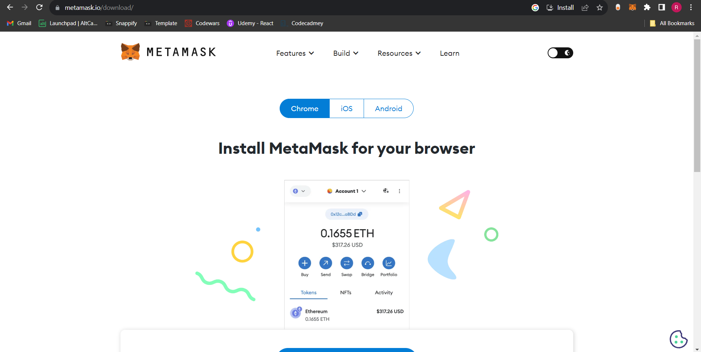

# Make a Metamask Account :zap:

Just like we need a bank account to hold all our money. We need cryptocurrency wallet to hold all our tokens.

**Metamask** is the most popular _cryptocurreny wallet_ and _browser extension_ that allows users to manage, store, and interact with cryptocurrencies and decentralized applications (dApps) on the Ethereum blockchain and various other blockchain networks.

## Steps to create an account on Metamask 📝

Follow these steps to make your _cryptocurrency wallet_. This wallet will be used to make transactions on the blockchain network and test the applications, we will make going forward.

### Step :one: : Install the Metamask Extension

- Install the MetaMask browser extension for your preferred web browser (e.g., Chrome, Firefox, Brave). You can find the extension in your browser's extension store.

 

### Step :two: : Open MetaMask

- Click on the MetaMask extension from your extentions list in your browser's toolbar to open the MetaMask interface.

 

### Step :three: : Create a Wallet

- Click on **"Get Started"**
- On the next page, you will see 2 options — "Import Wallet" and "Create a Wallet". Click on **"Create a Wallet"**.

 

- Create a strong password and keep it safe.
- Metamask will generate a Mnemonic phrase for you. This is also called the seed phrase or recovery phrase. It consists of 12 random words.This phrase is important for wallet recovery and backup. Store it well.
- Confirm your recovery phrase and Viola your wallet is ready!

